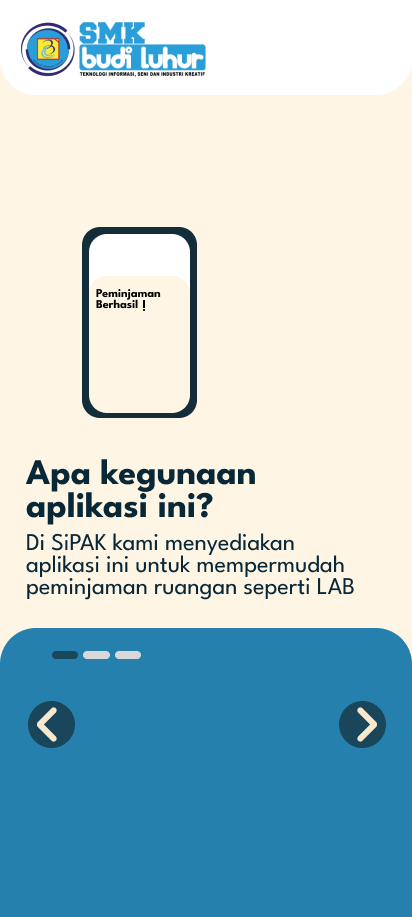
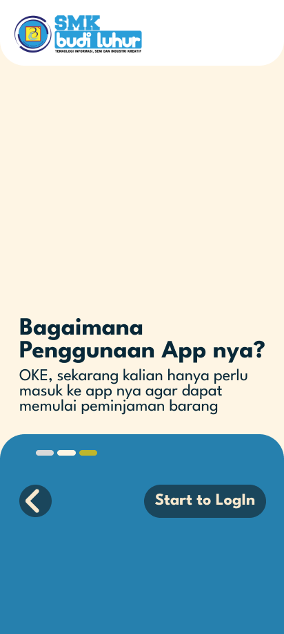

<h1 align="center"> Peminjaman Ruangan & Fasilitas</h1>


---
<h1 align="center"> Aplikasi Peminjaman Ruangan & Fasilitas Sekolah</h1>

Aplikasi ini digunakan untuk mempermudah proses peminjaman ruangan dan fasilitas sekolah budiluhur secara digital.  
Dibuat untuk mengurangi proses manual, meningkatkan efisiensi, dan memastikan pencatatan data yang rapi.

## Fitur Utama
- **Manajemen Peminjaman**: Guru dan siswa dapat mengajukan peminjaman ruangan/fasilitas.
- **Persetujuan Admin**: Admin dapat memverifikasi dan menyetujui atau menolak permintaan peminjaman.
- **Pengaturan Kapasitas Ruangan**: Admin dapat mengatur kapasitas dan ketersediaan setiap ruangan.
- **Riwayat Peminjaman**: Semua pengguna dapat melihat riwayat peminjaman mereka.
- **Notifikasi**: Memberi informasi status peminjaman (disetujui/ditolak).

---

## Jenis Pengguna & Hak Akses

### 1. **Admin**
- Mengelola data ruangan dan fasilitas sekolah.
- Mengatur kapasitas, jadwal, dan status ketersediaan.
- Melihat semua permintaan peminjaman.
- Menyetujui atau menolak permintaan.
- Mengelola data akun guru dan siswa.

### 2. **Guru**
- Mengajukan peminjaman ruangan dan fasilitas.
- Melihat status dan riwayat peminjaman.
- Membatalkan peminjaman yang belum disetujui.
- Menggunakan ruangan/fasilitas sesuai jadwal yang telah disetujui.

### 3. **Siswa**
- Mengajukan peminjaman fasilitas (sesuai kebijakan sekolah).
- Melihat status dan riwayat peminjaman.
- Membatalkan peminjaman yang belum disetujui.

---

## Teknologi yang Digunakan
- **Frontend**: HTML, CSS, JavaScript (TailwindCSS)
- **Backend**: PHP / Laravel *(atau sesuai implementasi)*
- **Database**: MySQL

---

## Instalasi

1. **Clone repository**
   ```bash
   git clone https://github.com/PitengSitanggang/Peminjaman-Ruangan-Fasilitas.git
   cd Peminjaman-Ruangan-Fasilitas

---

<h1 align="center"> ERD Flowchart Aplikasi</h1>

<p align="center">
  
</p>

<h1 align="center"> Basis Data Aplikasi </h1>

<p align="center">
  
</p>

<h1 align="center"> Diagram Activity </h1>

<p align="center">
  
</p>

<h1 align="center"> Use Case Diagram </h1>

<p align="center">
  
</p>


<h1 align="center"> Tampilan aplikasi </h1>


| Start Page | Start 1 | Start 2 | Component |
|------------|-----------------|----------------|-----------------|
|  |  |  |  |


